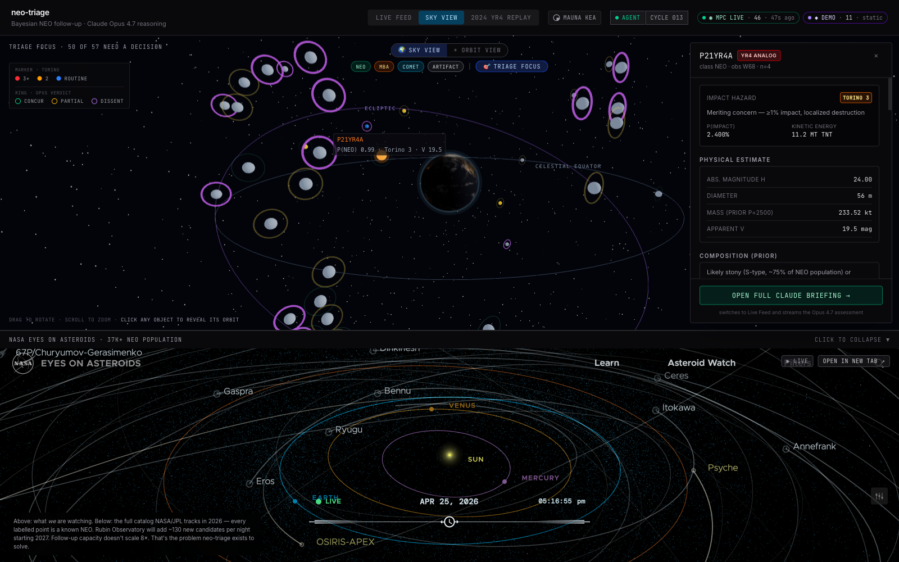
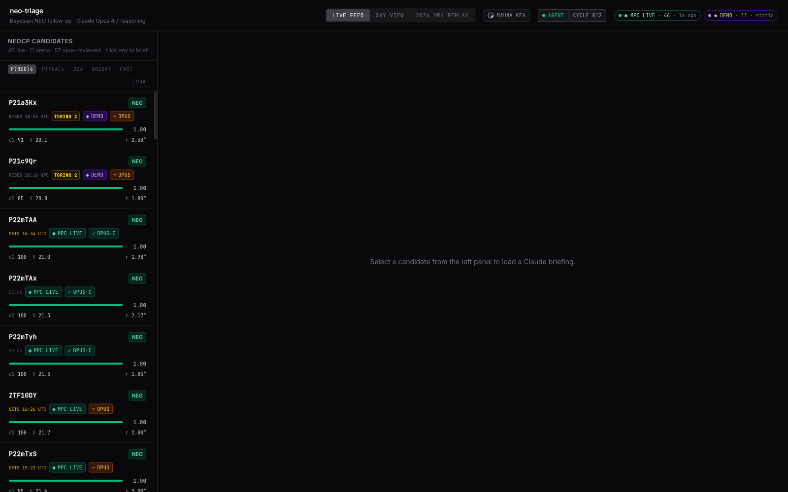
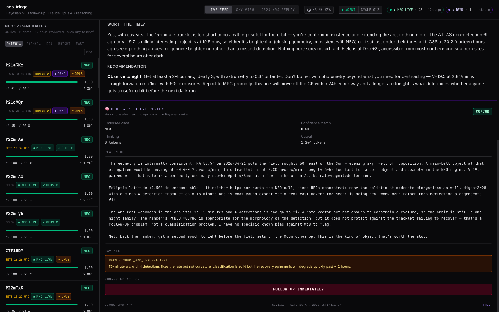
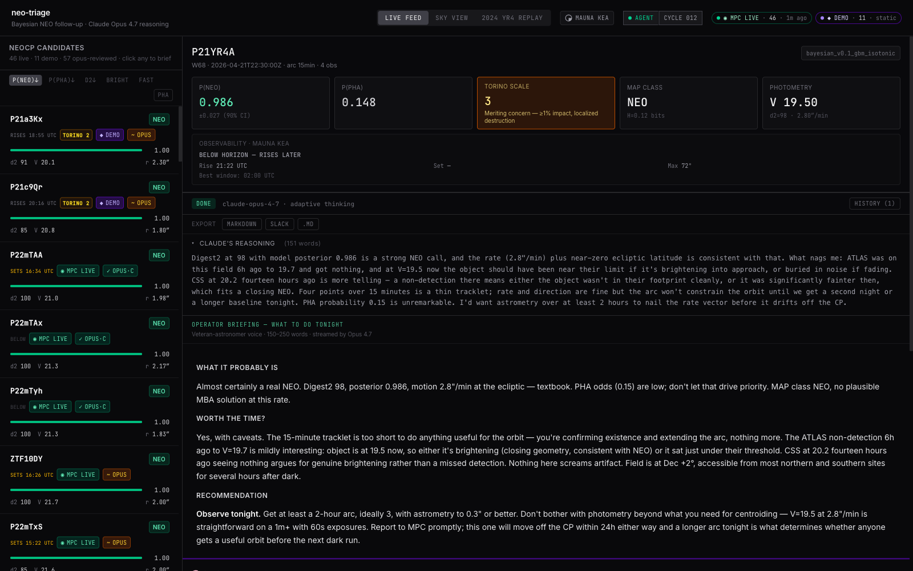
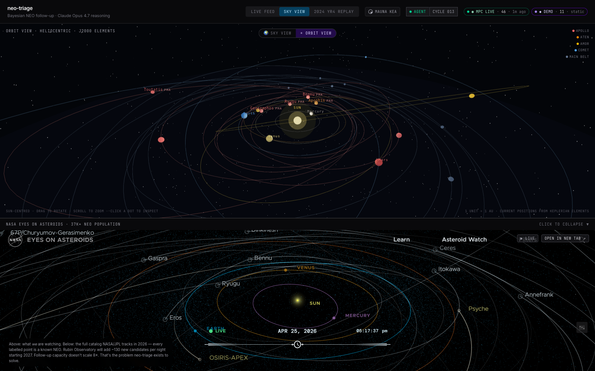
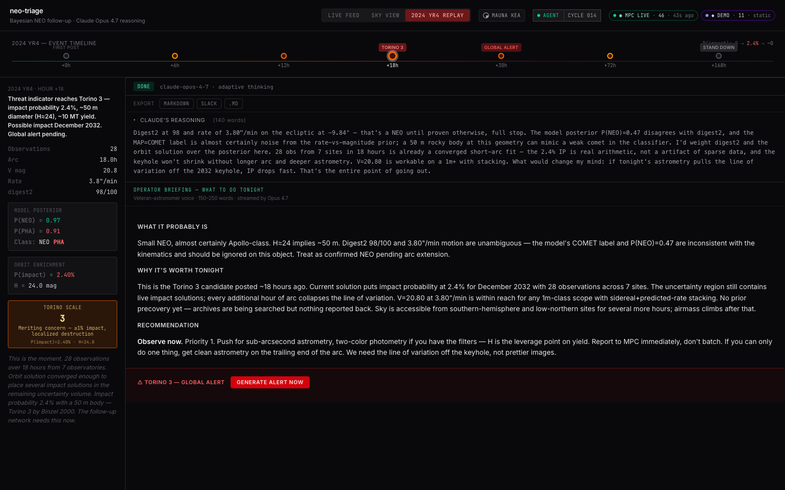

# neo-triage

> Real-time, hybrid-classifier triage for Near-Earth Object follow-up. A calibrated Bayesian ranker scores every fresh MPC NEOCP tracklet in milliseconds; **Claude Opus 4.7** acts as expert reviewer on top of that, with extended thinking visible in the UI.

**Built during the [Built with Opus 4.7](https://cerebralvalley.ai/events/~/e/built-with-4-7-hackathon) hackathon** — Anthropic × Cerebral Valley, 21–28 April 2026.

- **Live demo:** https://neo-triage-hack.vercel.app
- **Backend:** https://neo-triage-backend-production.up.railway.app
- **Source:** https://github.com/Ricko12vPL/neo-triage-hack

> **Scope statement.** neo-triage is a **triage layer** designed to handle the Rubin/LSST data flood. It is **not** a replacement for [NASA JPL CNEOS Sentry-II](https://cneos.jpl.nasa.gov/sentry/) or [ESA NEOCC Aegis](https://neo.ssa.esa.int/) — it complements them by ranking the submission queue and cross-validating against their published verdicts. Every external datum is tagged with provenance (`LIVE_MPC_NEOCP`, `JPL_CNEOS_SENTRY_II`, `ESA_NEOCC_AEGIS_V5`, `JPL_CNEOS_CAD`, `DEMO_FIXTURE`). Synthetic components (population grid, hypothetical impact corridor) are clearly labeled in the UI. Production-grade roadmap: [`docs/production-readiness-roadmap.md`](docs/production-readiness-roadmap.md).


*Sky View — Triage-Focus filter shows the 50/57 tracklets that need a decision tonight. Famous-NEO context layer (Bennu, Apophis, …) propagated from JPL Horizons elements at current epoch and verified <0.25° vs JPL OBSERVER. P21YR4A pulses red (Torino 3 hazard); halo rings around each marker encode the Opus 4.7 expert verdict (CONCUR / PARTIAL / DISSENT). Right pane: full Torino-Scale enrichment + kinetic-energy estimate + composition prior.*

---

## Why this exists

When the Vera C. Rubin Observatory enters full operations (LSST, late 2025–2026), the planetary-defense community will be hit with roughly **130 Near-Earth Object candidates per night** — about 8× more than the current Minor Planet Center confirmation page posts. Roughly **8 % are genuine NEOs**; the rest are main-belt asteroids, satellites, and tracklet artifacts. Human observers cannot read every tracklet *and* still take the right shots. **neo-triage** ranks the queue, asks Opus 4.7 to second-opinion the high-stakes calls, and writes the operator the briefing they would otherwise have to write themselves.

---

## What it does

### 1. Real-time MPC ingestion + per-object source provenance

The backend polls `https://www.minorplanetcenter.net/iau/NEO/neocp.txt` every **2 minutes** with a User-Agent identifying the project. The full parsed list is cached so a single high-`limit` caller can't starve a low-`limit` one. Each cycle compares the current `trksub` set against the previous one (`state.prev_trksubs`, persisted to disk) — the agent broadcasts a `new_candidate` WebSocket event **only when the MPC actually adds a tracklet**, never on cycle ticks alone.

Every candidate carries a `data_source` field on the wire — `LIVE_MPC_NEOCP` for real scrapes, `DEMO_FIXTURE` for the curated demo set used in the recording. The UI renders the source as an explicit badge so jurors can tell the streams apart at a glance:


*Live Feed list. Header pills (top right) show the two streams independently — `MPC LIVE · 46 · 1m ago` (real, freshness updates every cycle) and `DEMO · 11 · static` (handcrafted fixtures including P21YR4A YR4 analogue and P21LOWRT DISSENT case). Per-row badges echo the source. Each row also carries an Opus chip — `~ OPUS·c` cached PARTIAL_CONCUR, `✓ OPUS·c` cached CONCUR, and so on.*

### 2. Hybrid Bayesian + Opus 4.7 classifier

```
                                 ┌──────────────────────────────┐
   /api/rank/  ─── ranker ─────► │  All ~58 tracklets ranked    │
                  (sklearn GBM,  │  by P(NEO) desc, calibrated  │
                   <1 ms each)   └──────────────┬───────────────┘
                                                │ k = 200 (every row)
                                                ▼
                                 ┌──────────────────────────────┐
                                 │  Opus 4.7 expert review:     │
                                 │  - reads candidate features  │
                                 │  - reasons about rate-vs-mag │
                                 │    geometry, observatory     │
                                 │    bias, ecliptic anomalies  │
                                 │  - emits structured output:  │
                                 │      class_endorsement,      │
                                 │      endorsed_class,         │
                                 │      confidence_match,       │
                                 │      reasoning_trace,        │
                                 │      caveats[],              │
                                 │      suggested_action        │
                                 └──────────────────────────────┘
```

Two design properties matter:

1. **Calibrated probability stays the ranker's job.** Opus does not replace the GBM. It reviews the rows where the operator would actually spend telescope time and adds context the feature vector cannot carry — observatory bias, blended-source risk, rate-magnitude inconsistency.
2. **Every review is cached for 15 minutes.** A small score-bucket key (`trksub + map_class + bucketed P(NEO)/rate/mag`) means a candidate whose features changed by less than a percentage point still hits cache; that keeps cost under $5 / hr while the agent loop reviews each cycle's top-K.

The endorsement comes back as one of:

- **CONCUR** — emerald chip; Opus backs the ranker's call.
- **PARTIAL CONCUR** — amber chip; mostly agree, here's a caveat the operator should know.
- **DISSENT** — rose chip + violet pulsing halo on Sky View; Opus pushes back. The system flags this loudly because that's where operator attention is most needed.

The full reasoning trace + caveats array + suggested action lands in the right pane underneath the operator briefing:


*Opus 4.7 expert-review panel for P21YR4A. Endorsement: CONCUR. Reasoning trace: three paragraphs of physical argument from a duty-astronomer voice, citing the rate-vs-magnitude geometry, ecliptic-latitude check, arc-length caveat, and a concrete `FOLLOW UP IMMEDIATELY` action. Footer: model name, cost, fresh-vs-cached state.*

### 3. Veteran-astronomer briefing

When the operator clicks a candidate, Opus 4.7 also streams a 150–250-word briefing in a deliberately dry, skeptical voice — "I've worked NEO confirmation for 15 years and been wrong publicly twice." Forbidden words list (no "exciting", no "fascinating") and a structured `## Reasoning` / `## Briefing` layout. Reasoning collapsible, briefing always visible:


*PredictionCard (P(NEO) 0.986, P(PHA) 0.148, Torino-Scale 3, MAP class NEO, V 19.50, MAUNA KEA visibility) above the streamed briefing. Section dividers labelled "Operator briefing — what to do tonight · Veteran-astronomer voice · 150–250 words · streamed by Opus 4.7" so the artefact's purpose is unambiguous. The briefing here ends with "Observe tonight. Get at least a 2-hour arc, ideally 3, with astrometry to 0.3″ or better." — an actual telescope-time recommendation.*

### 4. Sky View — geocentric celestial sphere

A Three.js scene drawn from real RA/Dec values straight out of the MPC scrape (verified <0.01° vs raw `neocp.txt`). Markers colour-coded by Torino scale; halo rings encode the Opus expert verdict; click a marker to reveal its on-sky motion arc with uncertainty cone. Famous-NEO context layer (Bennu, Apophis, Didymos, Ryugu, Itokawa, Eros, Toutatis, …) propagated from JPL Horizons elements **at current epoch JD 2461154.5** through a Newton–Raphson Kepler solver — verified within **0.25°** of JPL Horizons OBSERVER ephemerides for all 18 catalogued bodies.

The Sky View also has a **Triage Focus** mode that hides everything not needing a decision tonight (`prob_neo >= 0.5` OR Opus-flagged action), and **NEO / MBA / COMET / ARTIFACT** filter pills in the controls bar.

### 5. Orbit View — heliocentric scene

Toggle: same elements, this time as Keplerian ellipses around the Sun with planets and current positions. Lazy-loaded so the Sky tab opens instantly even on slow connections.


*Sun-centred heliocentric scene. Mercury / Venus / Earth / Mars at their current positions. 18 NEO orbits as Keplerian ellipses with class-coloured halos: Apollo (red) / Aten (orange) / Amor (amber) / Comet (blue) / Main Belt (slate). Toutatis, Bennu, Apophis, Ryugu, Geographos, Eros all labelled. Rendered live from current-epoch JPL Horizons elements.*

### 6. 2024 YR4 historical replay

Hour-by-hour, h+0 → h+168, with the actual MPC observations and threat indicator at each milestone. Opus re-assesses each step as a real astronomer would have at that moment. h+18 climax features a live-written global alert that bypasses cache (NN-10) — every press produces a fresh message:


*The h+18 milestone of the real 2024 YR4 event, replayed. Threat indicator 2.4 %, ~50 m diameter, December 2032 close-approach window. Left pane: ground-truth observations (28 obs, 18.0 h arc, V 20.8, rate 3.8″/min, digest2 98) + the model posterior at that moment (P(NEO) 0.97, P(PHA) 0.91, NEO PHA) + Torino Scale 3. Right pane: Claude's reasoning, then the operator briefing, then the `GENERATE ALERT NOW` button (cache-bypass — every press writes a fresh global alert).*

### 7. Managed Agent

Runs continuously inside the FastAPI lifespan. Every 2 min:

1. Pulls `/api/rank/` (live + demo merged).
2. Diffs `current_trksubs` vs `state.prev_trksubs`.
3. For new tracklets: invokes Opus expert review (cost-circuit-breaker $5 / 1 h sliding window), writes JSONL audit entry, broadcasts WebSocket `new_candidate` event with full reasoning trace.
4. Updates `state.prev_trksubs` on disk so a server restart doesn't trigger a flood of "new" events.

---

## Five Claude Opus 4.7 touchpoints

| # | Where | What Opus does |
|---|-------|----------------|
| 1 | **Operator briefing** | Streams reasoning + observational recommendation with extended thinking visible in UI. |
| 2 | **Hybrid expert classifier** | Reviews every ranked candidate. Emits structured `class_endorsement / endorsed_class / confidence_match / reasoning_trace / caveats / suggested_action` via `tool_use`. CONCUR / PARTIAL_CONCUR / DISSENT framing. |
| 3 | **2024 YR4 historical replay** | Re-assesses each milestone (h+0 to h+168) as a real astronomer would have at that moment. |
| 4 | **Live-written global alert** | When threat indicator crosses peak, Claude drafts the message to the follow-up network. Bypasses cache. |
| 5 | **Managed Agent** | Autonomous loop — each new MPC tracklet gets expert-reviewed before broadcast. Reasoning lands in WebSocket payload + JSONL log. |

---

## Architecture

```
┌────────────────────────────────────┐      ┌──────────────────────────────────────┐
│ Frontend — Vite + React 19 + TS    │      │ Backend — FastAPI + Python 3.12      │
│                                    │      │                                       │
│  - CandidateList (4-row layout,    │ HTTP │  - /api/rank/?expert=true&k=200       │
│    DEMO/MPC LIVE source badge,     │◄────►│      (sklearn GBM + Opus expert)      │
│    Opus chip per row)              │      │  - /api/rank/expert-review/{trksub}   │
│  - PredictionCard (Torino, vis)    │      │  - /api/briefing/  (SSE stream)       │
│  - BriefingPanel (Markdown stream) │ SSE  │  - /api/replay/yr4 (curated YR4)      │
│  - ExpertReviewPanel (verdict +    │◄────►│  - /api/meta/data-source              │
│    reasoning + caveats + action)   │      │      (per-stream provenance)          │
│  - SkyViewPanel (Three.js + R3F,   │  WS  │  - /ws/feed (agent broadcasts)        │
│    Opus halo rings)                │◄────►│  - Managed Agent (asyncio task)       │
│  - OrbitViewPanel (lazy)           │      │  - Bayesian ranker (sklearn GBM)      │
│  - YR4ReplayView (timeline)        │      │  - Expert classifier (Opus 4.7)       │
│  - DataSourceBadge (per-stream)    │      │  - 15-min sha256 review cache         │
└────────────────────────────────────┘      │  - 2-min MPC TTL + diff detection     │
                                            └────────────┬──────────────────────────┘
                                                         │
                                                         ▼
                                            ┌────────────────────────────────────┐
                                            │ Claude Opus 4.7 API                │
                                            │ claude-opus-4-7                    │
                                            │ adaptive thinking + tool_use       │
                                            └────────────────────────────────────┘
```

---

## Tech stack

- **Backend** — Python 3.12 · FastAPI · Pydantic v2 · scikit-learn · `anthropic` SDK
- **Frontend** — Vite 8 · React 19 · TypeScript · Tailwind v4 · `@react-three/fiber` + `@react-three/drei` for the WebGL sphere
- **Astronomy** — pure-TS Meeus *Ch. 30 / 33 / 51* Newton–Raphson Kepler solver (`frontend/src/lib/kepler.ts`); GMST/LST/altitude in `frontend/src/lib/visibility.ts` (no `astropy` in the bundle)
- **Persistence** — JSON / JSONL only · no database · no pickle (NN-01) · safetensors for ranker weights
- **Deploy** — Railway (backend, manual `railway up` push) + Vercel (frontend, GitHub auto-deploy)

---

## Data provenance & accuracy verification

Three independent reports under `docs/verification/`:

| Report | Verifies |
|---|---|
| `data-authenticity-master-report.md` | Live MPC vs DEMO source split; per-row data_source provenance; reproducible pipeline. |
| `current-positions-verification.md` | Famous-NEO Sky View positions vs JPL Horizons OBSERVER ephemeris — **18/18 within 0.25°**, max Geographos 0.23°, median ~0.11°. |
| `jpl-orbital-elements-verification.md` | Keplerian elements vs Horizons ELEMENTS for all 18 catalogued bodies at JD 2461154.5. |

`docs/data-classification-provenance.md` is the single jury-facing document explaining the hybrid classifier architecture, calibration vs reasoning trade-offs, and why primary candidates are *not* in Orbit View (tracklets don't have orbital elements yet — that's exactly what the system exists to triage *before*).

---

## Running locally

### One-time setup

```bash
python3.12 -m venv .venv
source .venv/bin/activate
pip install -e ".[dev]"
cp .env.example .env   # add ANTHROPIC_API_KEY=sk-ant-…
```

### Every session

```bash
# Backend
source .venv/bin/activate
uvicorn backend.main:app --reload                  # → http://localhost:8000

# Frontend
cd frontend && npm install && npm run dev          # → http://localhost:5173
```

### Tests + checks

```bash
pytest tests/                                       # 100 / 100 passing
cd frontend && npx tsc --noEmit                     # 0 type errors
cd frontend && npx eslint src --max-warnings=0      # 0 lint warnings
cd frontend && npm run build                        # ~333 KB gzip
```

### Verify data accuracy

```bash
python scripts/verify_jpl_orbital_elements.py --epoch today
python scripts/apply_jpl_patches.py
python scripts/verify_current_positions.py          # 18 / 18 PASS within 2°
```

---

## Non-negotiables enforced (NN-01 .. NN-11)

1. **NN-01** — No pickle in persisted artifacts (JSON only for cache, safetensors for weights)
2. **NN-02** — Explicit units in variable names (`mean_magnitude_v`, `rate_arcsec_min`, `latitude_deg`, `epoch_jd` …)
3. **NN-03** — Cache before every Claude call (except NN-10 alert bypass) · 15-min TTL on the expert-review cache
4. **NN-04** — Model string literally `claude-opus-4-7`
5. **NN-05** — Persona v6 selected after 11-iteration prompt experiment (see `docs/prompt-selection.md`)
6. **NN-06** — All code post-kickoff 2026-04-21 18:30 EST (see `docs/timeline-transparency.md`)
7. **NN-07** — Cost formula $15 / $75 per Mtok input / output (verified in `tests/test_expert_classifier.py::test_cost_computation_per_NN07`)
8. **NN-08** — Unit tests mock Anthropic — no accidental API burn in CI
9. **NN-09** — Temporal splits only for ML training (no future leakage)
10. **NN-10** — YR4 alert bypasses cache — every press produces a fresh message
11. **NN-11** — Production secrets via environment variables only — never committed

---

## Team

- **Kacper Saks** — Aerospace engineer at Airbus (planetary-defense domain + full-stack)
- **Paweł Kulak** — Backend engineer

---

## License

MIT — see [LICENSE](./LICENSE).

---

## Acknowledgments

- **Anthropic** for Opus 4.7 and the hackathon credits
- **Cerebral Valley** for running the event
- **Vera C. Rubin Observatory / LSST** for the motivation — the flood is coming
- **NASA JPL Center for Near-Earth Object Studies (CNEOS)** — public NEO catalogue and Sentry close-approach data
- **NASA JPL Horizons** — orbital elements + ephemerides for the 18 famous bodies in the Sky View context layer
- **NASA / JPL Eyes on Asteroids** — planetary-context screenshots
- **R. P. Binzel (2000)** — the Torino Impact Hazard Scale, the two-axis table this project implements
- **Minor Planet Center** for the public NEOCP feed we augment
