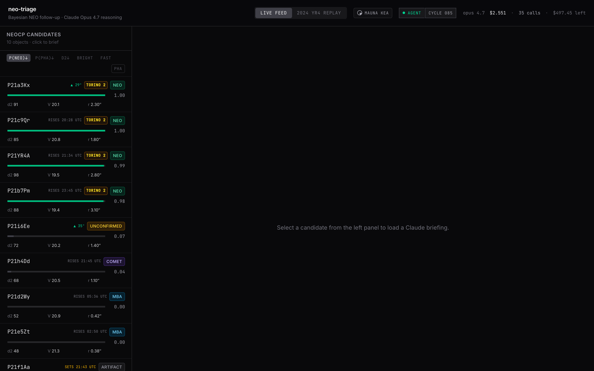
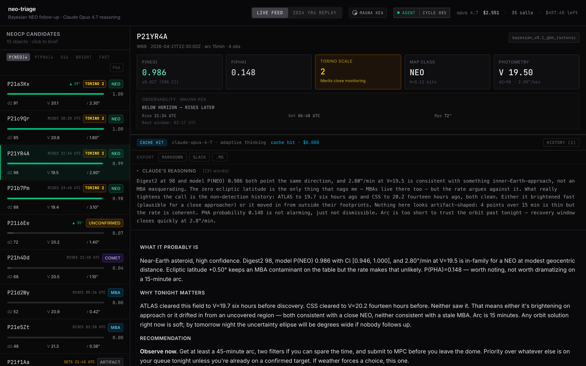
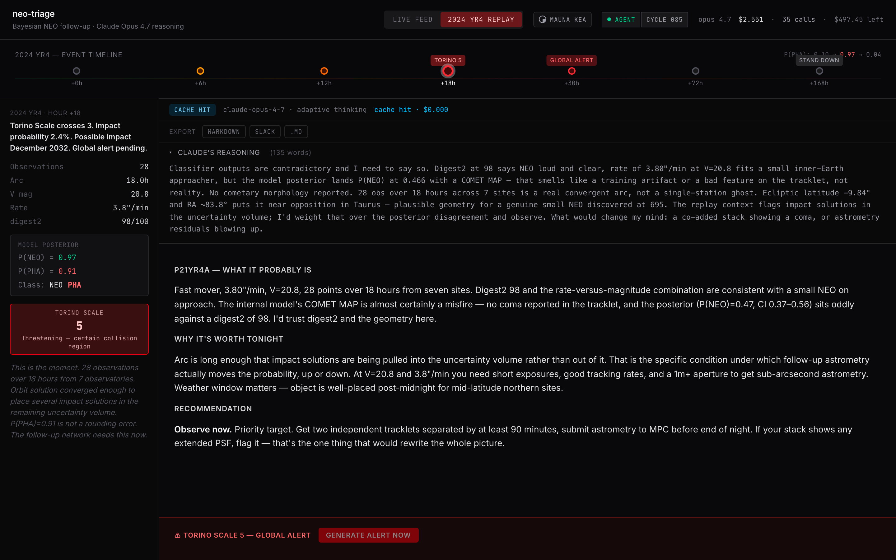

# neo-triage

> Bayesian Near-Earth Object follow-up prioritization, with Claude Opus 4.7 as the astronomy reasoning engine.

**Built during the [Built with Opus 4.7](https://cerebralvalley.ai/events/~/e/built-with-4-7-hackathon) hackathon** — Anthropic × Cerebral Valley, 21–28 April 2026.

---

## The problem

When the Vera C. Rubin Observatory enters full operations, it will flood the planetary-defense community with roughly **130 Near-Earth Object candidates per night** — about 8× more than the current Minor Planet Center confirmation page posts. Roughly **8% are genuine NEOs**; the rest are main-belt asteroids, satellites, or tracklet artifacts. Human observers cannot read every tracklet and still take the right shots.

## What neo-triage does

- Ranks every candidate by calibrated P(NEO) / P(PHA) from a Bayesian classifier.
- Asks **Claude Opus 4.7** to write the per-candidate observational briefing — dry, specific, cites numbers, names what would change its mind.
- Runs a **Managed Agent** continuously in the background — pulls fresh candidates every 5 minutes, broadcasts new detections over WebSocket, writes a JSONL audit trail.
- Replays the real **2024 YR4** event hour-by-hour so the reasoning is auditable against ground truth.
- Generates the **global alert** live when the threat indicator peaks — uncached, fresh every time.

## Four Claude Opus 4.7 touchpoints

| # | Where | What Opus does |
|---|-------|----------------|
| 1 | Per-candidate briefing | Streams reasoning + observational recommendation with extended thinking visible in UI |
| 2 | YR4 historical replay | Re-assesses each milestone (h+0 to h+168) as a real astronomer would have at that moment |
| 3 | Live-written global alert | When threat indicator crosses peak, Claude drafts the message to the follow-up network — bypasses cache (NN-10) |
| 4 | Managed Agent | Autonomous loop — scores new tracklets, decides what to surface to humans |

## Screenshots

### Live Feed — ranked candidates with Torino badges, observer-aware visibility



### Briefing — Claude's reasoning first, then the recommendation



### 2024 YR4 Replay — h+18 threat peak with live-written alert



## Key features

- **5-dimensional sort** — P(NEO), P(PHA), digest2, magnitude, rate — plus PHA-only filter
- **Tonight visibility per candidate** — pure-TypeScript Meeus GMST/LST/altitude, 4 observer presets (Mauna Kea, Warsaw, Cerro Tololo, La Palma) plus custom lat/lon
- **Torino Scale badge** — visual hazard indicator across candidate list, prediction card, YR4 timeline, agent alert banner
- **Briefing history** — session-scoped last 20 with instant restore (no re-stream cost)
- **Copy / export briefing** — Markdown, Slack flavor, `.md` download
- **Agent WebSocket feed** — new candidates arrive in the UI without refresh
- **Cost meter** — spend visible at all times, every Claude call logged with token counts

## Live demo

- **Frontend (Vercel):** https://neo-triage-hack.vercel.app
- **Backend (Railway):** https://neo-triage-backend-production.up.railway.app
- **Health check:** https://neo-triage-backend-production.up.railway.app/health
- **Source:** https://github.com/Ricko12vPL/neo-triage-hack
- **Demo video:** `docs/demo-assets/demo.mp4` _(recording Friday 2026-04-24)_

## Architecture

```
┌────────────────────────────────────┐      ┌──────────────────────────────┐
│ Frontend — Vite + React + TS       │      │ Backend — FastAPI + Python   │
│                                    │ SSE  │                              │
│  - CandidateList (sort/filter)     │◄────►│  - /api/rank/ (sklearn GBM)  │
│  - PredictionCard (Torino, vis)    │      │  - /api/briefing/ (Opus 4.7) │
│  - BriefingPanel (stream, history) │  WS  │  - /api/replay/yr4 (curated) │
│  - YR4ReplayView (timeline)        │◄────►│  - /ws/feed (agent updates)  │
│  - AgentAlertBanner                │      │  - Managed Agent (async)     │
└────────────────────────────────────┘      │  - Content-addressed cache   │
                                             └───────────┬──────────────────┘
                                                         │
                                                         ▼
                                            ┌────────────────────────────┐
                                            │ Claude Opus 4.7 API        │
                                            │ claude-opus-4-7            │
                                            │ extended thinking + stream │
                                            └────────────────────────────┘
```

## Tech stack

- **Backend:** Python 3.12 · FastAPI · Pydantic v2 · scikit-learn · anthropic SDK
- **Frontend:** Vite 8 · React 19 · TypeScript · Tailwind v4
- **Astronomy:** Pure-TS Meeus Ch.12 GMST/LST/altitude (no astropy in the bundle)
- **Persistence:** JSON/JSONL only — no database, no pickle (NN-01)
- **Deploy:** Railway (backend) + Vercel (frontend)

## Team

- **Kacper Saks** — Aerospace engineer at Airbus (planetary-defense domain + full-stack)
- **Paweł Kulak** — Backend engineer

## Running locally

### One-time setup

```bash
python3.12 -m venv .venv
source .venv/bin/activate
pip install -e ".[dev]"
cp .env.example .env   # fill in ANTHROPIC_API_KEY
```

### Every session

```bash
source .venv/bin/activate
uvicorn backend.main:app --reload     # → http://localhost:8000

cd frontend && npm install && npm run dev   # → http://localhost:5173
```

### Tests

```bash
pytest                              # backend: 78/78
cd frontend && npm run lint         # 0 errors
cd frontend && npm run build        # 71 kB gzip
```

## Non-negotiables enforced (NN-01..NN-11)

1. **NN-01** — No pickle in persisted artifacts (JSON only for cache, safetensors for weights)
2. **NN-02** — Explicit units in variable names (`mean_magnitude_v`, `rate_arcsec_min`, `latitude_deg`, ...)
3. **NN-03** — Cache before every Claude call (except NN-10 alert bypass)
4. **NN-04** — Model string literally `claude-opus-4-7`
5. **NN-05** — Persona v6 selected after 11-iteration prompt experiment (see `docs/prompt-selection.md`)
6. **NN-06** — All code post-kickoff 2026-04-21 18:30 EST (see `docs/timeline-transparency.md`)
7. **NN-07** — Cost formula $15 / $75 per Mtok input/output (verified in `tests/test_cost.py`)
8. **NN-08** — Unit tests mock Anthropic — no accidental API burn in CI
9. **NN-09** — Temporal splits only for ML training (no future leakage)
10. **NN-10** — YR4 alert bypasses cache — every press produces a fresh message
11. **NN-11** — Production secrets via environment variables only — never committed

## License

MIT — see [LICENSE](./LICENSE).

## Acknowledgments

- **Anthropic** for Opus 4.7 and the hackathon credits
- **Cerebral Valley** for running the event
- **Vera C. Rubin Observatory / LSST** for the motivation — the flood is coming
- **Minor Planet Center** for the NEOCP interface we augment
